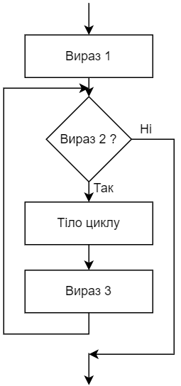
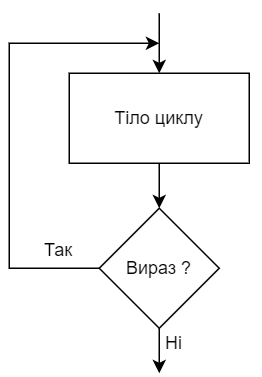

= Лабораторна робота №7

== Основні ключові слова, типи даних та управляючі конструкції C/C&#43;&#43;

=== Короткі теоретичні відомості

*Алфавіт мови С&#43;&#43;, ідентифікатори та ключові слова*

Для програмування будь-яких завдань мовою C&#43;&#43;, необхідно знати такі конструкції:
ідентифікатори, службові слова, описи даних та функцій, вирази, оператори, вбудовані функції, управляючі конструкції та деякі інші.

Вирази в мові C&#43;&#43;
записуються за допомогою 26 рядкових та 26 прописних літер англійського алфавіту:  abcdefghijkImnopqrstuvwxyz, ABCDEFGHIJKLMNOPQRSTUVWXYZ; десяти цифр: 0123456789; таких спеціальних символів: + - * / =, . _ : ; ? \ " ’~ | ! # $ & ( ) [ ] { } ^ @. До спеціальних символів відноситься також пропуск. Комбінації деяких символів, не розділених пропусками, інтерпретуються як один значущий символ: &#43;&#43; -- || && << >> >= <= == != &#43;= -= *= /= .?: :: /* */ //

*Ідентифікаторами* називаються імена, що надають змінним, константам, типам даних і функціям, які використовуються в програмах. Після опису ідентифікатора, можна посилатися на об'єкт, що позначається ним.

*Ідентифікатор* – це послідовність символів довільної довжини, яка містить літери, цифри й символи підкреслення, обов'язково починається з літери, або символу підкреслення.
У C++ враховується регістр букв. Компілятор сприймає прописні і рядкові букви, як різні символи. Так, змінні userName та UserName розглядаються як два різні ідентифікатори.

*Ключові слова* є зарезервованими ідентифікаторами, кожному з яких відповідає певна дія. Змінити призначення ключового слова неможна (директива препроцесора #define дозволяє створити "псевдонім" ключового слова, який дублює його дії, можливо, з деякими змінами). Імена ідентифікаторів, що створюються в програмі, не повинні збігатися з ключовими словами мов C/C++

*Стандартні типи даних*

Кожна програма обробляє певну інформацію. У C&#43;&#43; дані мають один з базових типів: *char* (текстові дані), *int* (цілі числа), *float* (числа з плаваючою точкою одинарної точності), *double* (числа з плаваючою точкою подвійної точності), *void* (порожні значення), *bool* (логічні значення), перерахування й покажчики.

Текстом (тип даних *char*) є один символ. Зазвичай кожен символ займає 8 біт або один байт з діапазоном значень від 0 до 255.

Цілі числа (тип даних *int*) знаходяться в діапазоні від – 32 768 до 32 767 раніше займали 16 біт, тобто два байти, або одне слово. У Windows NT і Windows XP і сучасніших ОС Windows використовуються 32-розрядні цілі числа, що дозволяє розширити діапазон значень від – 2 147 483 648 до 2 147 483 647.
У C&#43;&#43; підтримуються три типи цілих чисел.
Разом із стандартним типом *int* існують типи *short int* (коротке ціле) і *long int* (довге ціле).
Допускається скорочений запис *short* і *long*.

Числа з плаваючою точкою одинарної точності (тип даних *float*) можуть бути представлені як у фіксованому форматі, так і в експоненціальному. Діапазон значень – від ± 3.4Е-38 до ± 3.4Е+38, розмірність – 32 біта, тобто 4 байти або 2 слова.
Числа з плаваючою точкою подвійної точності (тип даних *double*) мають діапазон значень від ± 1.7Е-308 до ± 1.7Е+308 і розмірності 64 біт, тобто 8 байтів або 4 слова. Раніше існував тип *long double* з розмірністю 80 біт і діапазоном від ± 1.18Е-4932 до ± 1.18Е+4932. У нових 32 розрядних версіях компіляторів він еквівалентний типу *double* і підтримується з міркувань зворотної сумісності з написаними раніше програмами.

Перерахування представляються кінцевим набором іменованих констант різних типів.

Тип даних *void*, як правило, застосовується у функціях, що не повертають ніякого значення. Цей тип даних також можна використовувати для створення узагальнених покажчиків.

Покажчики, на відміну від змінних інших типів, містять не дані в звичайному розумінні цього слова, а адреси пам'яті, де зберігаються дані.

Змінні нового логічного типу даних *bool* в C&#43;&#43; можуть містити тільки одну з двох констант: *true* або *false*.
Компілятор мови C&#43;&#43; дозволяє при описанні змінних вказувати модифікатор *unsigned*. Він застосовується з чотирма типами даних: *char*, *short*, *int* і *long*. Наявність даного модифікатора вказує на те, що значення змінної повинне інтерпретуватися як беззнакове число, тобто найстарший біт є бітом даних, а не бітом знаку. Існує модифікатор *signed*, який виконує протилежну **unsigned** дію.

*Пріоритет операцій*

Як і в інших мовах програмування, в мові C&#43;&#43; діють правила пріоритету (порядку виконання) операцій у виразах. Пріоритети операцій наведені в таблиці.

.Пріоритети операцій
|===
|Операція |Опис |Асоціативність

|++
|Постфіксний (префіксний) інкремент
|Зліва направо

|--
|Постфіксний (префіксний) декремент
|Зліва направо

|()
|виклик функції
|

|[]
|Доступ до елемента масиву
|

|-&gt;
|Непрямий доступ до члена класу
|

|.
|Прямий доступ до члена класу
|

|!
|Логічне НЕ
|

|~
|Побітове НЕ
|

|-
|Унарний мінус
|

|+
|Унарний плюс
|

|&
|Отримання адреси
|

|*
|Розкриття покажчика
|

|sizeof
|Отримання розмірності виразу в байтах
|

|new
|Динамічне створення об'єкта
|

|delete
|Динамічне видалення об'єкта
|

|(тип даних)
|Приведення типу
|

|.*
|Прямий доступ до покажчика на член класу (через об'єкт)
|Зліва направо

|-&gt;*
|Непрямий доступ до покажчика на член класу (через покажчик на об'єкт)
|

|*
|Множення
|Зліва направо

|/
|Ділення
|Зліва направо

|%
|Ділення по модулю
|Зліва направо

|+
|Додавання
|Зліва направо

|-
|Віднімання
|Зліва направо

|<<
|Зсув ліворуч
|Зліва направо

|>>
|Зсув праворуч
|

|<
|менше
|Зліва направо

|>
|більше
|

|&lt;=
|менше, або дорівнює
|

|&gt;=
|більше, або дорівнює
|

|==
|дорівнює
|Зліва направо

|!=
|не дорівнює
|

|&amp;
|побітове І
|Зліва направо

|^
|Побітове АБО (що виключає)
|Зліва направо

|&#124;
|Побітове АБО
|Зліва направо

|&amp;&amp;
|Логічне І
|Зліва направо

|&#124;&#124;
|Логічне АБО
|Зліва направо

|?:
|Умовний вираз
|Справа наліво

|=
|Просте присвоювання
|Справа наліво

|*= /= %= += -= <&lt;= >>= &amp;= &#124;= ^=
|присвоювання з множенням, діленням ...
|

|,
|кома
|Зліва направо

|===

У мовах C/C&#43;&#43; усі стандартні функції знаходяться у бібліотеках, які можна підключити за допомогою заголовочних файлів. Так, функції введення-виведення у стилі мови C описані у файлі stdio.h (cstdio). Функції та класи для введення-виведення у стилі C++ описані у файлах iostream (для введення-виведення із використанням стандартного пристрою) та fstream (для файлового введення-виведення). Обчислення у програмах на С/С&#43;&#43; неможливі без використання математичних функцій, які описані у файлі math.h (cmath)

*Розглянемо приклад*: Знаходження значення похідної функції в точці.

_Постановка завдання:_ Задана функція y=sin(x). Знайти її похідну в точці x=π /2.
Для знаходження похідної в точці використовується відомий вираз:

[source,c++]
----
#include <math.h>
#include <iostream>
using namespace std;
int main() {
    double dx=1.0e-11;     // Вибираємо приріст аргументу
    double x = 3.1415926;  // Вибираємо точку для обчислення похідної
    double f1=sin(x+dx);   // Обчислюване значення функції в точці x+dx
    double f2=sin(x);      // Обчислюване значення функції в точці x
    double pf=(f1-f2) /dx; // Знаходимо значення похідної
    cout << "dsin(x) /dx=" << pf <<" x= "<<x;
    return 0;
}
----

*Оператор if*

Оператор *if* призначений для виконання команди або блоку команд залежно від того, істинно задана умова, чи ні.

Формат оператора *if*:

`if (умова) вираз;`

Якщо в результаті перевірки умови повертається значення *true*, виконується вираз, після чого управління передається наступному рядку програми.

Якщо ж результатом перевірки умови є значення *false*, вираз пропускається.
Оператор *if/else* дозволяє вибірково виконувати одну з двох дій залежно від умови. Формат даної інструкції має вигляд:

`if (умова) вираз 1; else вираз 2;`

Якщо в результаті перевірки умови повертається значення true, виконується вираз 1, інакше – вираз 2.
Якщо операторна частина гілки іf або else містить не один вираз, а декілька, необхідно укласти їх у фігурні дужки. Після закриваючої фігурної дужки крапка з комою не ставиться.
Оператор if обох форм реалізують алгоритми, представлені на рисунку

Як аналізований вираз в операторові if найчастіше використовується одна з операцій відношення.

*Оператор switch/case*

Оператор switch/case дозволяє залежно від значення деякого виразу вибрати один з багатьох варіантів продовження програми.
Оператор має такий формат:

[source,c++]
----
switch(expr) {
    case val1: op1; break;
    case val2: op2; break;
...
    case valN: opN; break;
    default: opN+1;
}
----

Оператор switch/case реалізує алгоритм, наведений на рисунку

Оператор *switch/case* може бути використаний у варіанті без оператора N+1.
Як вираз при операторі *switch* зазвичай використовується змінна типу *int* або *char*, хоча можна використовувати й складніші вирази, в які входять, наприклад, арифметичні або логічні операції над декількома змінними та константами.
Як значення при операторі *case* зазвичай використовуються просто константи (у числовій формі або в символьній, якщо вони були заздалегідь визначені за допомогою оператора препроцесора #define), проте можуть використовуватися і вирази над константами.
Виконання оператора *switch* починається з обчислення виразу в дужках, який повинен давати цілочисельний результат. Цей результат послідовно порівнюється із значеннями при операторах *case*, і, якщо буде виявлено рівність результатів, то виконується оператор відповідного *case*. Якщо збіги результатів не виявлено, виконується оператор при операторі *default*, якщо оператор *default* відсутній, то починають виконуватися оператори, наступні за всією конструкцією **switch/case**.

*Оператори break, continue і goto*

*Оператор break* використовується для виходу з оператора while, do...while, for і switch, що безпосередньо його містить. Управління передається на оператор, наступний за оператором, з якого здійснюється вихід. Приклад використання оператора break наведений вище.

*Оператор continue* використовується для ігнорування частини виконуваної ітерації циклу, який безпосередньо його містить, що залишилася. Якщо умовами циклу допускається нова ітерація, то вона виконується, інакше цикл завершується.

*Оператор goto* реалізує безумовний перехід, тобто дозволяє перейти в будь-яку точку програми, як вперед по тексту програми, так і назад. Точка переходу позначається за допомогою мітки, яка є довільним ідентифікатором з двокрапкою в кінці.

*Оператори циклів*

Оператори циклів використовують для виконання деякого фрагмента програми кілька разів. В окремих випадках фрагмент виконується в кожному послідовному кроці циклу без змін; частіше кожен крок циклу декілька відрізняється від попереднього.

Для грамотної реалізації будь-якого циклічного обчислювального процесу необхідно виконати дії, представлені у вигляді узагальненого алгоритму на рисунку

_Підготовка циклу_ полягає у визначенні початкових значень змінних, що будуть змінюватися у циклі, до початку виконання циклу

_Блок повторення_ - це дії, які повторюються в циклі. Вони завжди однакові, при цьому їх багаторазове повторення здійснюється при різних значеннях змінних циклу.

_Модифікація_ - це зміна значень параметрів циклу перед кожним новим повторення циклу.

Блок повторення та Блок модифікації разом складають _тіло циклу_.

_Умова продовження циклу_ (команда переходу) полягає в перевірці умови продовження або закінчення циклу, тобто визначає скільки разів потрібно повторити тіло циклу.

Існує три види циклів: while, for і do…while.

*Оператор циклу while* називається циклом з передумовою та має такий формат:

`while (вираз) тіло циклу;`

Оператор while реалізує алгоритм, представлений на рисунку

Як вираз, допускається використовувати будь-який вираз мови С&#43;&#43;, а як тіло – будь-який оператор, зокрема порожній або складений. Схема виконання оператора while така:

. Обчислюється вираз.
. Якщо вираз false, то виконання оператора while закінчується і виконується наступний за порядком оператор. Якщо вираз true, то виконується тіло циклу.
.	Процес повторюється з пункту 1.
.	Тіло циклу виконується доти, поки значення виразу дорівнює true.
.	Вираз обчислюється перед кожним виконанням оператора.

*Цикл for* має такий формат:

`for (вираз 1; вираз 2; вираз 3;) тіло циклу;`

Оператор for реалізує алгоритм, представлений на рисунку

Вираз 1 зазвичай використовується для встановлення початкового значення змінних, які управляють циклом. Вираз 2 – це вираз, що визначає умову, при якій тіло циклу виконуватиметься. Вираз 3 визначає зміну змінних, що управляють циклом після кожного виконання тіла циклу.

Схема виконання оператора for

.	Обчислюється _вираз 1_.
.	Обчислюється _вираз 2_.
.	Якщо значення _виразу 2_ відмінно від нуля (true), виконується тіло циклу,
. Обчислюється _вираз 3_ і здійснюється перехід до пункту 2
. Якщо вираз 2 дорівнює нулю (false), то управління передається до оператора, наступного за оператором for.

Істотне те, що перевірка умови завжди виконується на початку циклу. Це означає, що тіло циклу може жодного разу не виконатися, якщо умова виконання відразу буде хибною.

Цикл for є зручним скороченим записом для циклу while вигляду

[source,c++]
----
expr 1;
while (expr 2) {
   body-of-loop;
   expr 3;
}
----

Вираз 1 задає початкові умови виконання циклу, вираз 2 забезпечує перевірку умови виходу з циклу, а вираз 3 модифікує умови, задані виразом 1.

Будь-який з виразів може бути опущений. Якщо опущено вираз 2, то за замовчуванням замість нього підставляється значення true.

Наприклад, цикл:

`for (;вираз 2;) тіло циклу;`

з опущеними вираз 1 і вираз 3 еквівалентний циклу

`while (вираз 2) тіло циклу;`

Цикл

`for (;;) тіло циклу;`

зі всіма опущеними виразами еквівалентний циклу

`while (true) тіло циклу;`

тобто еквівалентний нескінченному циклу.

Такий цикл може бути перерваний тільки явним виходом з нього за допомогою операторів *break*, *goto* або *return*, що містяться в тілі циклу.

Оператор циклу *do while* називається оператором циклу з постумовою і використовується в тих випадках, коли необхідно виконати тіло циклу хоч би один раз. Формат оператора має такий формат:

`do тіло циклу while (вираз);`

Схема виконання оператора *do while*:

. Виконується тіло циклу (яке може бути складеним оператором).
.	Обчислюється вираз.
.	Якщо вираз false, то виконання оператора do while закінчується й виконується наступний за порядком оператор. Якщо вираз true, то виконання оператора продовжується з пункту 1.

Щоб перервати виконання циклу до того, як умова стане хибною, можна використовувати оператор break.

Оператор *do while* реалізує алгоритм, наведений на рисунку

На відміну від циклу *while*, в якому перевірка умови закінчення циклу робиться _до виконання_ тіла циклу, в циклі *do while* така перевірка має місце _після виконання_ тіла циклу. Отже, тіло циклу *do while* буде виконано _хоча б один раз_, навіть якщо вираз  має значення false із самого початку.

== Завдання 7.1
Представити математичний запис фрагмента програми та обчислити значення змінної x після його виконання, де n – це номер варіанта

[cols="1,4,1,4"]
|===
^|Варіант ^|Фрагмент ^|Варіант ^|Фрагмент

^|1-3
| `*var* x = 1 +
*for* (j *in* 7 downTo n) x *= j +
x *= 2`
^|4-6
| `*var* x = 0 +
*var* j = 1 +
*do* { +
&nbsp;&nbsp;&nbsp;&nbsp;x += j +
&nbsp;&nbsp;&nbsp;&nbsp;j += 2 +
} *while* (j &lt;=n)`

^|7-9
| `*var* x = 0.0 +
*var* k - 3 * n +
*while* (k > 0) { +
&nbsp;&nbsp;&nbsp;&nbsp;x = sqrt(k+x) +
&nbsp;&nbsp;&nbsp;&nbsp;k -= 3 +
}`

^|10-12
| `*var* x = n +
*for* (k *in* 0..5) { +
&nbsp;&nbsp;&nbsp;&nbsp;**if** (k < 2) *continue* +
&nbsp;&nbsp;&nbsp;&nbsp;x++ +
}`

^|13-15
| `*var* x = 0 +
*for* (j *in* 0 until n) x += 2 +
x *= 2`

^|16-18
|`*var* x = 1 +
*while* (x &lt;= n) x++
x *= 2`
|===

== Завдання 7.2
Скласти програму табулювання функції _f(x)_  на відрізку [_a_; _b_] з кроком _h_
Значення _a_, _b_, _h_ вводити з клавіатури.

[cols="1,3,1,3,1,3"]
|===
^|Варіант ^|Функція ^|Варіант ^|Функція ^|Варіант ^|Функція

^|1
| \[ y = \frac{tg x}{ln x} \]
^|2
| \[y = \sqrt[3]{x}\]
^|3
| \[y = tg (ln x)\]
^|4
| \[y= \frac{ln(x-1)}{4-x}\]
^|5
| \[y=tg^2 (ln x)\]
^|6
| \[y=ctg(ln x)\]
^|7
| \[y=x^{0.2}\]
^|8
| \[y=\frac{x}{1+tgx}\]
^|9
| \[y=\frac{ln(x-0.5)}{\sqrt{x}}\]
^|10
| \[y=\frac{sin x^3}{2-x}\]
^|11
| \[y=\frac{cos^3 x}{1 - lgx}\]
^|12
| \[y=\frac{tg x}{lnx-1}\]
^|13
| \[y=\frac{e^2}{\sqrt{1 - x^2}}\]
^|14
| \[y=\frac{x+1}{\sqrt{x}} - \sqrt[4]{\|x - 2\|} \]
^|15
| \[y=\frac{ln \|2x\|}{sinx - \pi}\]
^|16
| \[y=e^{ln x -1} + sin x\]
^|17
| \[y= \frac{4-x}{ln(x-1)}\]
^|18
| \[y=\frac{e^{x ^ 2}}{\sqrt{1 - x^2}}\]
|===

== Завдання 7.3
Для заданих _x_, _n_, _eps_, що вводяться з клавіатури:

["loweralpha"]
. Обчислити суму _n_ доданків згідно з варіантом.
. Обчислити суму тих доданків, які за абсолютним значенням більше _eps_.
(Завдання виконати для двох різних _eps_, які відрізняються на порядок, для кожного випадку обчислити кількість доданків)
. Порівняти результати з "точним" значенням відповідної функції (сума визначає наближене значення) для _x Є (-R,R)_

*Примітка 1.* У цьому завданні значення _x_ повинно належати області допустимих значень, визначеної у пункті c, значення n повинно бути досить великим (більше 20). _eps_ потрібно обирати як маленьке додатне число, яке не більше 1e-9. Виконати обчислення для двох РІЗНИХ _eps_, що відрізняються не менше ніж на порядок (в 10 або більше разів).

*Примітка 2.* Результат виконання пункту b вважається задовільним, та програма може бути зарахована як правильна, лише за умови, що різниця між "точним" значенням функції та значеннями, обчисленими за наближеними сумами, взята за модулем, є числом, що менше або дорівнює _eps_.

=== Варіант 1
\[\frac{sinx}{x} = 1 - \frac{x^2}{3!} + \frac{x^4}{5!} - \frac{x^6}{7!} + ... (R = \infty) \]

=== Варіант 2
\[e^{-x ^ 2} = 1 - \frac{x^2}{1!} + \frac{x^4}{2!} - ... + (-1)^n \frac{x^{2n}}{n!} (R = \infty) \]

=== Варіант 3
\[ ln(x + \sqrt{x^2 +1}) = x - \frac{1}{2} \cdot \frac{x^3}{3} + \frac{1}{2} \cdot \frac{3}{4} \cdot \frac{x^5}{5} - \frac{1}{2} \cdot \frac{3}{4} \cdot \frac{5}{6} \cdot \frac{x^7}{7} + ... (R=1) \]

=== Варіант 4
\[arctg x = x - \frac{x^3}{3} + \frac{x^5}{5} - \frac{x^7}{7} + \frac{x^9}{9} - ... (R =1) \]

=== Варіант 5
\[arcsin x = x + \frac{1}{2}\cdot\frac{x^3}{3} + \frac{1}{2}\cdot \frac{3}{4}\cdot\frac{x^5}{5} + \frac{1}{2}\cdot \frac{3}{4}\cdot\frac{5}{6}\cdot\frac{x^7}{7} + ... (R=1)  \]

=== Варіант 6
\[\frac{1}{\sqrt{1-x^2}} = 1 + \frac{1}{2}\cdot x^2 + \frac{1}{2}\cdot\frac{3}{4}\cdot x^4 + \frac{1}{2}\cdot\frac{3}{4}\cdot\frac{5}{6}\cdot x^6 + ... (R=1) \]

=== Варіант 7
\[\frac{1}{\sqrt{1+x}} = 1 - \frac{1}{2}\cdot x + \frac{1}{2}\cdot\frac{3}{4}\cdot x^2 - \frac{1}{2}\cdot\frac{3}{4}\cdot\frac{5}{6}\cdot x^3 + ... (R=1) \]

=== Варіант 8
\[\sqrt{1+x} = 1 + \frac{1}{2}\cdot x - \frac{1}{2 \cdot 4}\cdot x^2 + \frac{1 \cdot 3}{2 \cdot 4 \cdot 6}\cdot x^3 - ... (R=1) \]

=== Варіант 9
\[\frac{1}{(1+x)^3} = 1 - \frac{2 \cdot 3}{2} \cdot x + \frac{3 \cdot 4}{2}\cdot x^2 - \frac{4 \cdot 5}{2}\cdot x^3 + ... (R=1) \]

=== Варіант 10
\[\frac{1}{(1+x)^2} = 1 - 2x + 3x^2 - 4x^3 + 5x^4 - ... (R=1)\]

=== Варіант 11
\[\frac{1}{1+x} = 1 - x + x^2 - x^3 + x^4 - ... (R=1) \]

=== Варіант 12
\[ln\frac{1+x}{1-x} = 2 \cdot (x + \frac{x^3}{3} + \frac{x^5}{5} + \frac{x^7}{7} + \frac{x^9}{9} + ...)  (R=1) \]

=== Варіант 13
\[ln(1-x) = -\frac{x}{1} -\frac{x^2}{2} - \frac{x^3}{3} - \frac{x^4}{4} - ... (R=1) \]

=== Варіант 14
\[ln(1+x) = \frac{x}{1} -\frac{x^2}{2} + \frac{x^3}{3} - \frac{x^4}{4} - ... (R=1) \]

=== Варіант 15
\[ch(x) = 1 + \frac{x^2}{2!} + \frac{x^4}{4!} + \frac{x^6}{6!} + ... (R=\infty) \]

=== Варіант 16
\[sh(x) = 1 + \frac{x^3}{3!} + \frac{x^5}{5!} + \frac{x^7}{7!} + ... (R=\infty) \]

=== Варіант 17
\[cos(x) = 1 - \frac{x^2}{2!} + \frac{x^4}{4!} - \frac{x^6}{6!} + ... (R=\infty) \]

=== Варіант 18
\[sin(x) = x - \frac{x^3}{3!} + \frac{x^5}{5!} - \frac{x^7}{7!} + ... (R=\infty) \]

=== Варіант 19
\[e^x = 1 + \frac{x}{1!} + \frac{x^2}{2!} + \frac{x^3}{3!} + ... (R=\infty) \]

=== Варіант 20
\[e^{-x} = 1 - \frac{x}{1!} + \frac{x^2}{2!} - \frac{x^3}{3!} + ... (R=\infty) \]
